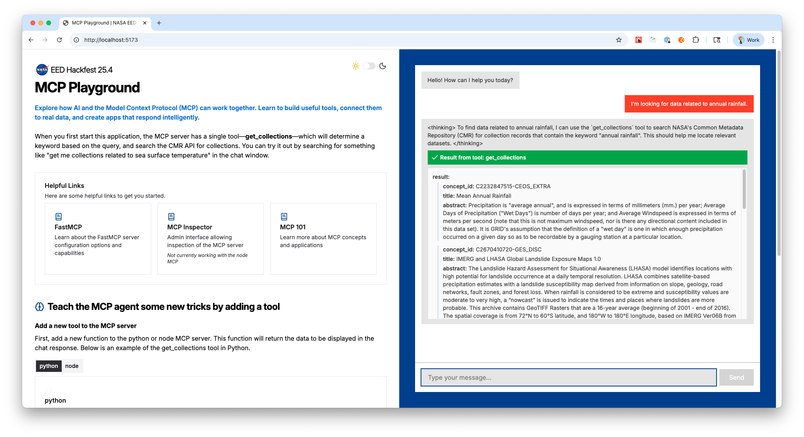

# 25.4 Hackfest 🎉

We’ve put together a starter repo that shows just how easy it is to build your own [Model Context Protocol (MCP)](https://modelcontextprotocol.io/docs/getting-started/intro) app. It comes with everything you need — a working MCP server (in both Node and Python), and a simple web UI that connects right to it.

Using FastMCP, you can spin it up locally and start adding your own tools in minutes. All you have to do is write one function, and you’ve created a working AI tool.

This hackfest is all about learning by doing:

- See how AI tools plug into real applications
- Experiment with adding your own functions
- Get a feel for how MCP makes it simple to connect data, code, and AI models

Whether you’re curious about AI or already deep in it, this is a fun way to explore how everything fits together. Bring your laptop, your ideas, and let’s build some AI magic together.



## Provided Technology

This section outlines the technology we've configured for you.

1. [FastMCP](https://gofastmcp.com/getting-started/welcome) ( [Python](https://github.com/jlowin/fastmcp) | [Node](https://github.com/punkpeye/fastmcp) )
2. [React Based Chat Interface](https://react.dev/)

---

## How to use the starter template

This section has all the steps to run the example template and see all the required technology in action. You **don’t have to use it**—it’s for inspiration or guidance.

### 1️⃣ Fork this repository

Use the fork option in the left-hand panel of the Bitbucket UI to create a copy
of the repository for your own project.

Clone the forked repository to your local environment (replacing the URL below
with your fork URL):

```
git clone ssh://git@git.earthdata.nasa.gov:7999/ea/hackfest-25.4.git
```

### 2️⃣ Configure your AWS Keys

> <https://docs.aws.amazon.com/cli/v1/userguide/cli-configure-envvars.html>

This project requires AWS Bedrock for minimal tool orchestration from the UI, in order to use that service you'll need to configure keys to an AWS account with necessary permissions.

**Ensure region is set to `us-east-1`**

#### Using existing AWS Keys

If you have existing access to an EDC AWS account, you can assume role into the account where we are providing access to AWS Bedrock.  To do this, use the normal method to get keys from kion and then run the following in your terminal:

```bash
export $(printf "AWS_ACCESS_KEY_ID=%s AWS_SECRET_ACCESS_KEY=%s AWS_SESSION_TOKEN=%s" \
$(aws sts assume-role \
--role-arn arn:aws:iam::325592785603:role/hackfest-25.4-bedrock \
--role-session-name $(whoami) \
--query "Credentials.[AccessKeyId,SecretAccessKey,SessionToken]" \
--output text))
```

After running this command, your terminal will be logged in to the "dev15" EDC account rather than the account you started with, and will have access ONLY to the Bedrock models and actions required for this project.  Ensure the same terminal is used to start the agent in step 4️⃣.  The assumed credentials will be good for 12 hours and then will need to be refreshed, starting with your own AWS credentials then running the above command again.

#### Using a Bedrock API Key

If you do not have access to an EDC AWS account, fear not!  Contact Timothy Goff with your NASA AUID and we will provide you with a Bedrock API key.  This key will need to be stored in an environment variable in your terminal before you start the agent in step 4️⃣ as shown below:

```bash
export AWS_BEARER_TOKEN_BEDROCK=<TOKEN VALUE>
```


### 3️⃣ Choose your MCP implementation

#### </> NodeJS

##### Install NVM

```bash
curl -o- https://raw.githubusercontent.com/nvm-sh/nvm/v0.40.3/install.sh | bash
```

```bash
cd mcp/fastmcp-node
nvm use
```

##### Install packages with nvm

```bash
npm install
```

##### Run MCP Server

```bash
npm run dev
```

#### 🐍 Python

##### Install uv

[uv](https://docs.astral.sh/uv/) is a Python package and project manager. It
can be installed via a few methods, however
[using homebrew](https://docs.astral.sh/uv/getting-started/installation/#homebrew)
may work best on NASA-managed machines.

```
brew install uv
```

Alternative installation options are also available in the
[documentation](https://docs.astral.sh/uv/getting-started/installation/),
including:

```
curl -LsSf https://astral.sh/uv/install.sh | sh
```

##### Create Python environment for the project

```
cd mcp/fastmcp-python

uv venv
source .venv/bin/activate
```

##### Install packages with uv

```
uv sync
```

##### Run MCP Server

```bash
uv run server.py
```

### 4️⃣ Run the chat client

#### Install NVM

```bash
curl -o- https://raw.githubusercontent.com/nvm-sh/nvm/v0.40.3/install.sh | bash
```

```bash
cd agent
nvm use
```

#### Install packages with nvm

```bash
npm install
```

```bash
npm run dev
```

### Debugging

If you get an error `Cannot find module @rollup/rollup-darwin-arm64.` run `rm -rf package-lock.json node_modules` the rerun the `npm install` and `npm run dev` above
